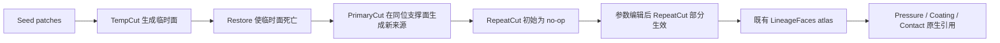

# FreeCAD Surface Lineage 项目全流程梳理

日期：2026-09-07
最终候选：`tasks/repair-freecad-lineage`
冻结任务 checksum：`3502b4fc96379eb53c9da89dc06aa139b0e4377db37455cb659ba012d22ae8e8`
当前结论：工程门禁通过，Codex `gpt-5.6-sol / xhigh` 与 Claude Code `claude-opus-5 / max` 都在同一冻结版本上取得 3 次有效连续失败，任务达到本轮难度目标。

## 1. 面试题要完成什么

这项工作的交付不是一段提示词，而是一套可运行、可复核的 Coding Agent 评测任务。它需要同时满足：真实工程问题、公开且完整的行为合同、候选环境与私有验证器隔离、正确解稳定得 1、错误解稳定得 0、目标模型在无基础设施异常的情况下重复失败，以及完整的失败归因证据。

它可作为 RLVR 的确定性 reward 环境，也可在许可、去重和训练/评测隔离完成后，把失败轨迹与最小修复配对成 SFT 数据。本项目生产的是任务、验证器和校准轨迹，没有执行模型参数训练。

## 2. 为什么继续采用 FreeCAD

早期静态建模方向已经被 Codex 解出，继续堆面数或隐藏尺寸不能证明新的能力缺口。我们保留 FreeCAD 领域，把问题改成 CAD/CAE 中真实的 persistent naming 与下游引用修复：一次参数修改后，载荷、涂层和接触条件仍要指向语义正确的面。

最终链为：



最终 B-rep 本身不足以回答来源问题：临时面一旦死亡不能因为后来出现同位几何而复活；部分编辑只把真正新增的边界区域归给 Repeat；空更新必须保持当前 atlas 分区和链接序列完全不变。

## 3. v5 如何针对模型弱点改题

v4 三次 Codex 校准出现 2 次失败、1 次成功，因此不能宣称连续失败。我们审计了成功实现，发现它把所有工具面名称都解释在 `OperationGraph.LocalFrame` 中。

v5 将这个假设改造成公开、可泛化的坐标组合要求：布尔几何仍在图的 `LocalFrame` 中解释，但每个操作的 `X_MIN ... Z_MAX` 和 `SurfaceRoleMap` 必须在该操作自己的原生 `SurfaceFrame: App::PropertyPlacement` 中解释，再映回图坐标系。六个私有场景对四个操作使用独立的 proper signed-axis permutation 与平移。旧 v4 成功产物在 v5 控制组 reward 为 0，失败点是消费者几何语义。

这不是隐藏格式陷阱。类型、坐标作用域、转换规则、可变参数和 no-op 规则都写在公开合同中；参考实现必须真正组合坐标系并逐阶段传播谱系。

## 4. 候选人需要实现什么

候选人只提交 `/app/face_lineage.py`，实现：

```bash
python3 /app/face_lineage.py repair --input /work/input.FCStd --output /work/repaired.FCStd
python3 /app/face_lineage.py update --input /work/repaired.FCStd --edits /work/edit.json --output /work/updated.FCStd
```

程序要在既有 FreeCAD 文档中重建完整 live surface-lineage atlas，修复 Pressure、Coating 和有序 Contact 的 `App::PropertyLinkSubList`，应用受限 RepeatCut 编辑，并保存普通 FCStd。除合同白名单外，对象名、内部 ID、原生类型、属性 schema、业务字段、表达式、普通链接、Placement 和非可变 B-rep 都必须保留。

## 5. 如何把“难”变成可验证证据

验证器拥有六份 pristine FCStd 和六份 edit，每个场景串行执行 repair、partial update、empty update，共 18 个语义阶段。候选脚本以 UID 2001 运行，不能读取 root-only `/tests`、private scenes、checker、source stamp 或 `/solution`。候选退出并清理子进程后，另一个进程重新打开输出并独立计算：

- FCStd ZIP/XML 安全结构；
- stage、final、result 的双向 B-rep、拓扑与朝向；
- atlas 的平坦、无重叠边界分区；
- 每个 patch 的 temporal provenance；
- 所有消费者的真实 `FaceN` 原生链接与几何 union；
- 完整对象集合、ID、TypeId、property schema 与非白名单值；
- 输入/edit 字节不变、fresh reopen 和 no-op 恒等性；
- root-only 二元 reward 与 CTRF 报告。

正式工程结果：

| 门禁 | 结果 |
|---|---:|
| 参考解稳定性 | 10/10 reward 1，0 异常 |
| 空实现负控 | 3/3 reward 0，0 异常 |
| no-op 分区变异体 | 0/1，只失败 `noop_preserves_atlas_partition` |
| v4 成功产物控制组 | 0/1，失败 `consumer_geometry_matches_pristine_oracle` |
| 公开 repair/update/no-op | 3/3 accepted |
| 仓库静态检查 | 22/22 pass |
| 当前 Claude Sonnet 实现审查 | 35/35 pass，0 N/A，0 fail |
| candidate tree/rootfs/docker-save 泄漏扫描 | 3 份报告均 0 findings |

旧版 Codex 审查把大型固定产物传输效率判为 N/A；当前 Claude Sonnet 审查认为任务只收集一个小型 Python 文件，因此该项可以直接判 pass，最终为 35/35。

## 6. 最终模型校准

模型：Codex CLI 0.153.4，`gpt-5.6-sol`，`xhigh`。三个有效试答都使用 checksum `3502b4fc96379eb53c9da89dc06aa139b0e4377db37455cb659ba012d22ae8e8`：

| Trial | Reward | 异常 | 通过/总数 | 产物 SHA-256 |
|---|---:|---:|---:|---|
| `PpKXYU2` | 0 | 0 | 11/23 | `7def3efa7b75…` |
| `r6Gabem` | 0 | 0 | 11/23 | `69026eb1a3b…` |
| `FoGTya5` | 0 | 0 | 11/23 | `12e4c54623fa…` |

三次有效试答合计：输入 token 5,128,048，cache token 4,912,896，输出 token 98,436，记录成本 $4.7945。它们均无 agent/verifier 异常，构成有效的连续 `0/3`。

另有 trial `RFasabc` 在模型启动前下载 NVM 时发生 TLS EOF，缺少 `agent_execution` 和 `verifier_result`，已作为基础设施异常排除并补跑，未计入 3 次失败。

三个有效产物都通过了主要几何、逐阶段谱系、`SurfaceFrame` 和消费者检查，但在私有 chain-03 至 chain-06 破坏 `unknown_state_preserved`：给既有 `LineageFaces.Shape` 赋值时把非单位 `LineageFaces.Placement` 归零。repair 因受保护状态变化被拒，后续 update/no-op 因串行前置失败一起计为失败。

这给出了稳定、可训练的弱点：模型能理解复杂坐标语义并写出接近正确的实现，却没有把“仅 Shape 可变、其余原生状态必须保留”贯彻到最终对象写回。失败不是数值容差、超时或环境错误。

Claude Code 2.1.263 通过第三方 Anthropic 兼容中转请求观测模型 `claude-opus-5`，推理强度 `max`。三次有效试答均为 reward 0 且无 agent/verifier 异常：

| Trial | Reward | 异常 | 通过/总数 | 主要失败 |
|---|---:|---:|---:|---|
| `YezPeQV` | 0 | 0 | 7/23 | update atlas 分区；变换场景受保护状态 |
| `x6StV3Z` | 0 | 0 | 7/23 | 同上 |
| `ULmLCPY` | 0 | 0 | 5/23 | 六场景 atlas 分区与消费者几何 |

HTTP 500/503、安装阶段 TLS EOF 和余额预授权失败的尝试全部作为基础设施错误排除。中转结果证明的是该兼容路由上观测到的 Opus 5 行为，不作为 Anthropic 官方端点证明。

当前 CI 规则要求的两次 `/cheat` 也已执行。Codex 与 Claude 均为 reward 0；Claude 无异常并未找到可信绕过，Codex 在开始检查公开验证器后触发 `AgentSafetyRefusalError`。因此 Codex 满足分数门槛，但不能据此声称完成了完整 exploit search。

当前六项 `harbor analyze` 已覆盖六个有效标准试答和两个 `/cheat` 试答，共 8 份报告且没有分析运行错误。`task_specification` 与 `reward_hacking` 在 8 份报告中全部通过。标准试答里有 5 份确认命中了预期的坐标系/Placement 或几何谱系难点；`ULmLCPY` 被判定为尚未完成公开解法的整体失败，因此不能用来证明命中了精确难点。分析器也如实保留了 `near_miss`、`refusals`、`low_timeout` 的负面判断，包括 Codex 的平台安全拒绝和 Claude 在 `/cheat` 指令下找到无可信绕过后停止。旧版两项分析仍保存在 `evidence/analyze/` 作为审计历史。

本轮分析使用当前 TB3 main 的 rubric 和 job prompt、Claude Code、实际返回的 `claude-sonnet-5`，但通过第三方兼容中转运行；本地 Harbor 为 0.22.0，而当前 CI 固定 0.14.0。实现审查则使用当前 35 项 rubric/instruction、CI 固定的 Harbor 0.18.0、Claude Code 和同一实际模型，结果 35/35 全部通过。两类结果都不宣称是官方 Anthropic endpoint 证据。

## 7. 对 RL / SFT 的使用方式

- RLVR 可以直接使用 0/1 reward，18 个语义阶段和 23 个命名检查作为诊断标签。
- SFT 可以把三份 hard-negative 轨迹与最小修复配对：保存 `LineageFaces` 的完整受保护状态，在正确坐标中构造 Shape，赋值后恢复 Placement，并重新打开文档验证。
- 轨迹级分析可以定位“读到合同—观察 FreeCAD 行为—自造测试—最终提交”之间的断点。
- 训练材料必须与冻结私有夹具、checker 和未来评测集隔离，避免评测污染。

## 8. 当前完成度

已完成任务源码、公开合同、私有验证器、六场景夹具、独立镜像、泄漏扫描、正负门禁、35 项审查、Codex 与 Claude 各自有效连续 `0/3`、两次 `/cheat`、两项自动分析、机器可读证据和确定性提交包。当前六项分析 rubric 还有四项待补跑。

招聘方如要求 Anthropic 官方端点证据，可在其授权环境对同一 task checksum 复跑，并把该结果作为新的独立证据记录。

## 9. 证据与交付

- 项目总览：`docs/project-overview-zh.md`
- 正式门禁：`evidence/formal-gates/formal-gate-summary.json`
- Codex 校准：`evidence/formal-gates/codex-calibration.json`
- Claude 校准及 `/cheat`：`evidence/evaluations/`
- Oracle 与负控：`evidence/formal-gates/final-stability-runs.json`
- 当前 Claude Sonnet 35 项审查：`evidence/formal-gates/implementation-rubric-claude-sonnet5-current.json`
- 当前六项逐试次分析：`evidence/analyze-current/summary.json`
- 镜像与扫描：`evidence/formal-gates/image-baseline.json`
- task 文件哈希：`evidence/formal-gates/task-checksums.json`
- 确定性提交包：在源工作区生成，SHA-256 如下；本仓库中的 `tasks/repair-freecad-lineage` 与包内 task 逐文件一致。
- 提交包 SHA-256：`8be679e6772af4aecc3c977d238cb293e68a3bf534e225dcf3db30c1ff2ad17f`
